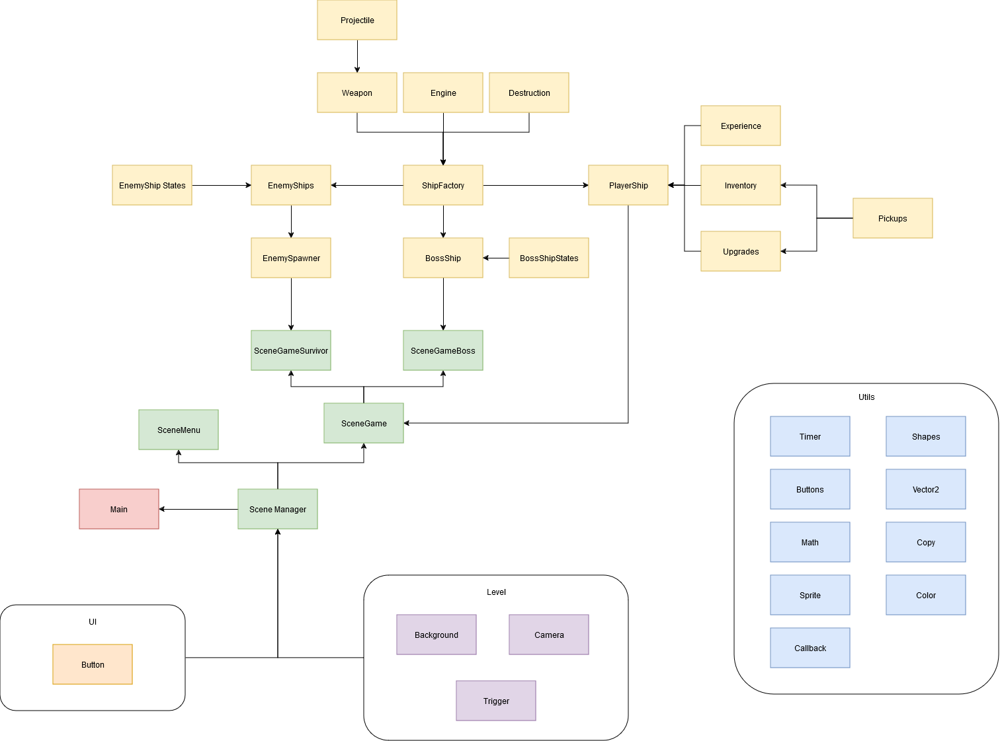

# Simple Space Shooter

## Principe de jeu
Simple Space Shooter est un jeu de type « Vampire Survivor » dans l'espace entrecoupé de boss fight exigeants.

### Joueur
* Le joueur contrôle un vaisseau spatial dont le niveau augmente lorsqu'il élimine des ennemis.
* Il peut tirer son arme principale et utiliser son boost
* À chaque niveau, le joueur peut choisir une amélioration parmi trois options pour augmenter ses dégâts, sa vie, sa vitesse de tir, etc.
* Tous les dix niveaux, le joueur peut choisir une nouvelle arme. Il y a 4 armes disponibles au total, chacune avec ses caractéristiques propres :
  * Auto Gun : arme de base, tir rapide et dégâts modérés
  * Big Space Gun : arme lourde, tir lent et dégâts moyens, mais ses balles traversent les ennemis
  * Rockers : arme légère, tir lent et faibles dégâts, mais ses balles sont à tête chercheuse
  * Zapper : arme lourde, tir à vitesse moyenne et dégâts élevés, les balles rebondissent sur les ennemis

### Ennemis
* Les ennemis apparaissent de manière aléatoire.
* Plus le niveau du joueur est élevé, plus le nombre d'ennemis augmente et plus ils apparaissent rapidement.
* Il y a trois types d'ennemis :
  * Fighter : ennemi léger qui tire des roquettes destructibles par le joueur.
  * Torpedo : ennemi kamikaze qui cherche à détruire le joueur en le percutant.
  * BattleShip : ennemi lourd qui tire des salves de 6 boules indestructibles.

* Tous les dix niveaux, un portail s'ouvre. Le joueur peut choisir d'y entrer pour affronter un boss.
* Le boss possède 3 patterns distincts et devient invincible entre chacun d'eux.

### But du jeu
Survivre le plus longtemps possible et accumuler le plus de point. Le score est affiché en haut a droite de l'écran

### Controles
#### Controle de base
* a: left
* w: up
* s: down
* d: right

* left_click: shoot or select
* left_shift: boost

* p: pause music
* escape: pause game
* space: return to main menu

* 1-4 : change weapon

#### Cheat Codes
* v: Spawn weapon selection menu
* t: Spawn upgrade selection menu
* y: Spawn boss vortex
* h: Spawn survival vortex
* return: Change level (from boss to survival and back)

## Code Source
### Structure

### Decoupage
#### Scenes
##### Scene Manager
Scene héritée par toutes les scènes, est appelée depuis le main et contient la scène actuelle

##### Scene Menu
Le jeu commence à la scène menu, elle est simple pour le moment et permet juste de lancer une partie.
Elle pourrait être améliorée pour implémenter un système de sauvegarde et un tableau des scores

##### Scene Game
Scene héritée par les scènes de gameplay. Elle contient la majorité des fonctions update et draw.
La boucle d'update contient deux fonctions qui sont lancées alternativement selon si le jeu est en pause :
* Update game : met à jour tous les éléments du jeu lorsqu'il n'est pas en pause
  * Update background : met à jour le fond du jeu pour qu'il soit positionné au même endroit que le joueur, avec un effet de parallaxe si la caméra bouge
  * update camera: bouge la camera pour qu'elle suive le joueur
  * Update playership: update le joueur
  * Update enemies: update tous les enemies
  * Update projectile: update les projectiles
  * Update trigger: update les trigger
* Update pause: met à jour les elements d'ui Interactif lorsque le jeux est en pause
  * Update button: update le boutton et réagit si on clique sur un des boutons en relançant le jeu

La boucle de draw est appelé pour draw tous les assets du jeu en permanence

##### Scene Survivor
Hérite de scene game et ajoute un enemy spawner pour faire apparaitre les ennemis a interval régulier

##### Scene Boss
Hérite de scene game et crée le boss lorsqu'elle se load

#### Utils
Contient tout un pannel d'utils pour gérer les sprite, le son, les vecteurs, ...

#### Level
Contient le background, la camera et les trigger

#### UI
Contient l'element principale utilisé pour génerer les UI: Button
Button permet de créer des rectangle qui réagisse si la souris passe dessus et clique.

#### Characters
Contient la majorité du code. 
##### Components
Composants utilisé pour créer les ships (joueur et ennemis)
* weapons
* projectiles
* engines
La diversité des ships qui sont présent dans le jeux vient des fichiers de configurations qui permettent de créer different type d'armes, de projectiles, ....

##### Ships
Contient le fichier ship factory, qui est la base de tous les vaisseau du jeu
Un ship est crée en combinant un sprite principal, un engine, une weapon, une animation pour la destruction et des charactéristique comme sa vitesse de déplacement, de rotation, ...

###### Player
Hérite de shipFactory
Override la fonction update pour implementer son deplacement a partir des inputs clavier et souris
Possède des sous modules 
* experience: permet de gérer l'experience du joueur et de declancher les upgrade au passage de niveau
* inventory: permet de stocker les armes du joueur et d'afficher l'UI pour ces armes
* upgrade: permet de mettre en pause le jeu et de proposer des nouvelles armes ou amélioration au joueur

###### Enemies
Hérite de shipFactory
Override la fonction udpate avec une state machine pour gérer les deplacement et les tirs

###### EnemyShip
Contient un fichier de configuration pour générer de la diversité dans les ennemis le plus facilement possible en jouant sur les armes et les parametre de la state machine
Contient un enemy spawner pour gérer le spawn des enemies

###### EnemyBoss
Contient le boss avec sa state machine personnel

### Machine à états
#### Machine à états des ennemis

* High speed chase: lorsqu'un ennemi est loin du joueur, il va accelerer pour l'atteindre le plus vite possible
* Chase: l'ennemi calcul un vecteur d'offset, il va ensuite essayer d'aller a la position du joueur plus cet offset. 
Lorsqu'il arrive, il calcul un nouvel offset et va a cette nouvelle position. L'offset est calculé de maniere a ce que l'ennemi tourne autour du joueur
* Avoid ship: Meme principe que chase sauf que l'offset est calculé pour que l'ennemi fui le joueur. La vitesse de l'ennemi est aussi accéléré pour faciliter sa fuite
* Get Around: Si le joueur essai de fuir trop loin de l'ennemi, celui ci va accelerer et contourner le joueur. 
Cela permets d'empecher les strategies ou le joueur fui toujours dans le meme sens

#### Machine à états du boss
